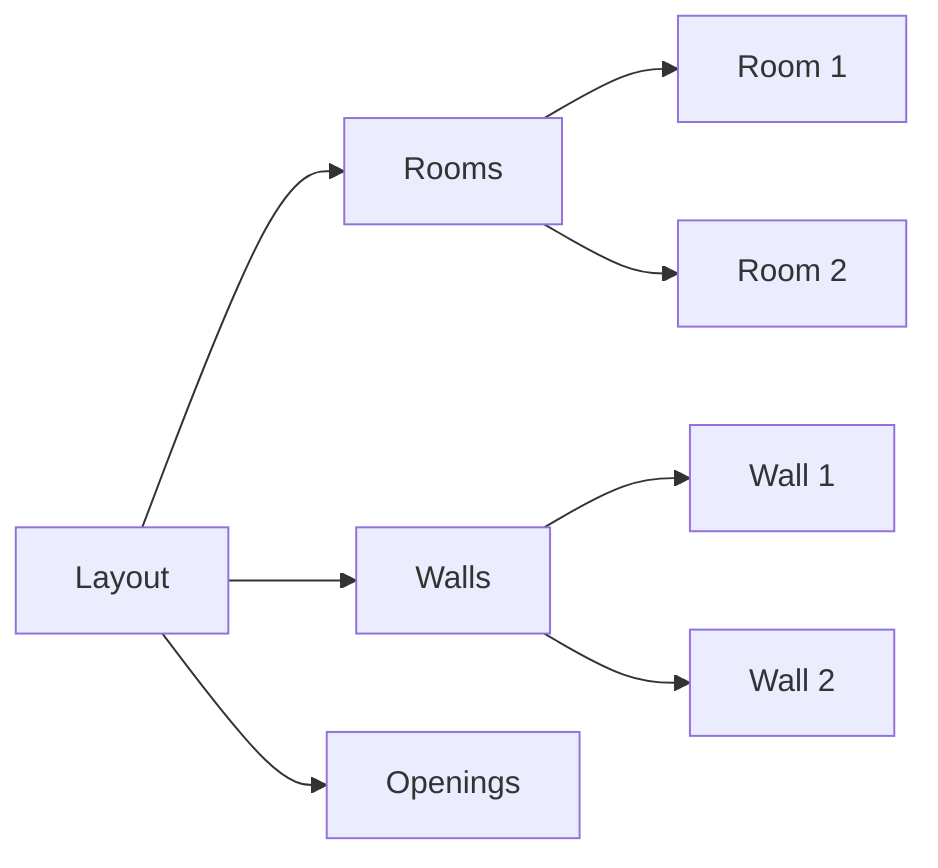

# Examples

This page provides practical examples of using the Open Architecture Standards.

## Simple Single Room

A basic example showing a single rectangular room:

```json
{
  "version": "1.0.0",
  "layout": {
    "id": "simple-room",
    "name": "Single Room Example",
    "rooms": [
      {
        "id": "room-1",
        "name": "Office",
        "program": "workspace",
        "boundaries": [
          {"x": 0, "y": 0},
          {"x": 4000, "y": 0},
          {"x": 4000, "y": 3000},
          {"x": 0, "y": 3000}
        ]
      }
    ],
    "walls": [
      {
        "id": "wall-north",
        "thickness": 200,
        "start": {"x": 0, "y": 0},
        "end": {"x": 4000, "y": 0}
      },
      {
        "id": "wall-east",
        "thickness": 200,
        "start": {"x": 4000, "y": 0},
        "end": {"x": 4000, "y": 3000}
      },
      {
        "id": "wall-south",
        "thickness": 200,
        "start": {"x": 4000, "y": 3000},
        "end": {"x": 0, "y": 3000}
      },
      {
        "id": "wall-west",
        "thickness": 200,
        "start": {"x": 0, "y": 3000},
        "end": {"x": 0, "y": 0}
      }
    ]
  }
}
```

## Multi-Room Layout

An example with multiple connected rooms:

```json
{
  "version": "1.0.0",
  "metadata": {
    "title": "Small Apartment",
    "description": "A compact studio apartment layout"
  },
  "layout": {
    "id": "studio-apartment",
    "name": "Studio Apartment Layout",
    "rooms": [
      {
        "id": "living-area",
        "name": "Living Area",
        "program": "living",
        "boundaries": [
          {"x": 0, "y": 0},
          {"x": 5000, "y": 0},
          {"x": 5000, "y": 4000},
          {"x": 0, "y": 4000}
        ]
      },
      {
        "id": "kitchen",
        "name": "Kitchen",
        "program": "kitchen",
        "boundaries": [
          {"x": 5000, "y": 0},
          {"x": 7500, "y": 0},
          {"x": 7500, "y": 3000},
          {"x": 5000, "y": 3000}
        ]
      },
      {
        "id": "bathroom",
        "name": "Bathroom",
        "program": "bathroom",
        "boundaries": [
          {"x": 5000, "y": 3000},
          {"x": 7500, "y": 3000},
          {"x": 7500, "y": 4000},
          {"x": 5000, "y": 4000}
        ]
      }
    ],
    "walls": [
      {
        "id": "partition-1",
        "thickness": 100,
        "start": {"x": 5000, "y": 0},
        "end": {"x": 5000, "y": 4000}
      },
      {
        "id": "partition-2",
        "thickness": 100,
        "start": {"x": 5000, "y": 3000},
        "end": {"x": 7500, "y": 3000}
      }
    ],
    "openings": [
      {
        "id": "kitchen-door",
        "type": "passage",
        "wall_id": "partition-1",
        "position": {"x": 5000, "y": 1500},
        "width": 1000,
        "height": 2200
      },
      {
        "id": "bathroom-door",
        "type": "door",
        "wall_id": "partition-2",
        "position": {"x": 6000, "y": 3000},
        "width": 800,
        "height": 2100
      }
    ]
  }
}
```

## Commercial Space

An example of a commercial office layout:

```json
{
  "version": "1.0.0",
  "metadata": {
    "title": "Office Suite",
    "description": "Small commercial office space"
  },
  "layout": {
    "id": "office-suite",
    "name": "Office Suite 301",
    "rooms": [
      {
        "id": "reception",
        "name": "Reception Area",
        "program": "reception",
        "boundaries": [
          {"x": 0, "y": 0},
          {"x": 6000, "y": 0},
          {"x": 6000, "y": 3000},
          {"x": 0, "y": 3000}
        ]
      },
      {
        "id": "conference",
        "name": "Conference Room",
        "program": "meeting",
        "boundaries": [
          {"x": 6000, "y": 0},
          {"x": 10000, "y": 0},
          {"x": 10000, "y": 4000},
          {"x": 6000, "y": 4000}
        ]
      },
      {
        "id": "office-1",
        "name": "Office 1",
        "program": "office",
        "boundaries": [
          {"x": 0, "y": 3000},
          {"x": 3000, "y": 3000},
          {"x": 3000, "y": 6000},
          {"x": 0, "y": 6000}
        ]
      },
      {
        "id": "office-2",
        "name": "Office 2",
        "program": "office",
        "boundaries": [
          {"x": 3000, "y": 3000},
          {"x": 6000, "y": 3000},
          {"x": 6000, "y": 6000},
          {"x": 3000, "y": 6000}
        ]
      }
    ],
    "walls": [
      {
        "id": "wall-main",
        "thickness": 150,
        "start": {"x": 6000, "y": 0},
        "end": {"x": 6000, "y": 6000},
        "material": "glass"
      }
    ],
    "openings": [
      {
        "id": "conference-door",
        "type": "door",
        "wall_id": "wall-main",
        "position": {"x": 6000, "y": 2000},
        "width": 1200,
        "height": 2400,
        "properties": {
          "type": "glass",
          "swing": "outward"
        }
      }
    ]
  }
}
```

## L-Shaped Room

An example showing a non-rectangular room:

```json
{
  "version": "1.0.0",
  "layout": {
    "id": "l-shaped-room",
    "name": "L-Shaped Living Space",
    "rooms": [
      {
        "id": "living-dining",
        "name": "Living-Dining Area",
        "program": "living",
        "boundaries": [
          {"x": 0, "y": 0},
          {"x": 6000, "y": 0},
          {"x": 6000, "y": 3000},
          {"x": 3000, "y": 3000},
          {"x": 3000, "y": 5000},
          {"x": 0, "y": 5000}
        ]
      }
    ]
  }
}
```

## Using Diagrams

### SVG Diagrams

You can include SVG diagrams directly in your documentation:

```markdown

```

SVG format is natively supported by browsers and MkDocs Material, providing crisp, scalable diagrams.

### Draw.io Diagrams

For Draw.io diagrams, simply reference the `.drawio` file:

```markdown

```

The `mkdocs-drawio-exporter` plugin will automatically convert these to PNG images during the build process.

### Mermaid Diagrams

You can also use Mermaid for simple diagrams directly in Markdown:



## Custom Properties Example

Using custom properties for extended functionality:

```json
{
  "version": "1.0.0",
  "layout": {
    "id": "custom-example",
    "name": "Example with Custom Properties",
    "rooms": [
      {
        "id": "bedroom",
        "name": "Master Bedroom",
        "program": "bedroom",
        "boundaries": [
          {"x": 0, "y": 0},
          {"x": 4000, "y": 0},
          {"x": 4000, "y": 4000},
          {"x": 0, "y": 4000}
        ],
        "x-floor-material": "hardwood",
        "x-ceiling-height": 3000,
        "x-lighting": {
          "type": "recessed",
          "count": 4
        },
        "x-furniture": [
          {
            "type": "bed",
            "position": {"x": 2000, "y": 2000},
            "size": {"width": 1800, "length": 2000}
          }
        ]
      }
    ]
  }
}
```

## Best Practices

!!! tip "Naming Conventions"
    Use descriptive IDs and names for easier identification and maintenance of your layouts.

!!! tip "Coordinate System"
    Start from a consistent origin point (usually bottom-left corner) and use consistent coordinate directions.

!!! tip "Wall Thickness"
    Standard interior walls are typically 100-150mm, exterior walls 200-300mm.

!!! tip "Documentation"
    Always include metadata in production documents to track versions and changes.
